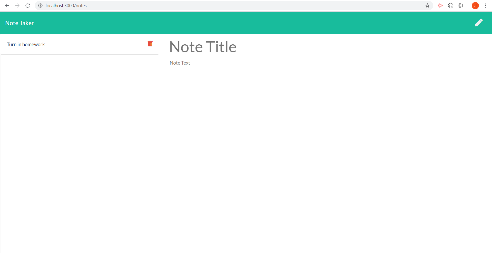

# Note-Taker

This is an application that can be used to write, save, and delete notes. This application will use an express backend and save, retrieve and delete note data from a JSON file. From the landing page the user can click the notes button to navigate to the notes page. Here the user can enter a new note and review or delete previous notes.

